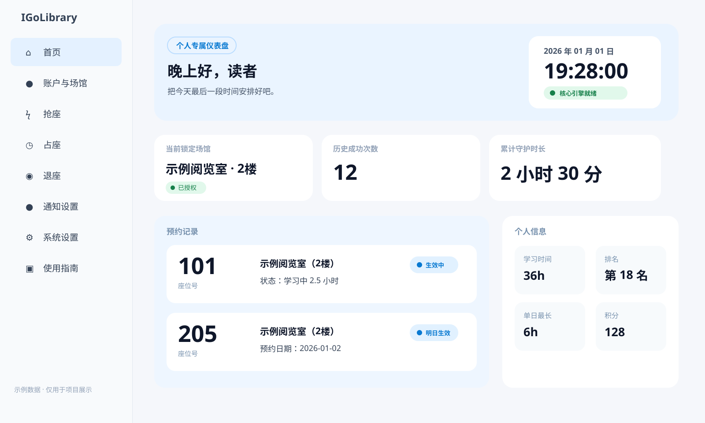

# IGoLibrary

IGoLibrary 是一个用于管理图书馆座位预约、抢座和占座任务的桌面应用。

## 首页预览

下面的截图使用完全虚构的示例数据，仅用于展示界面布局，不包含任何真实账户、Cookie、座位记录或个人统计信息。

## 功能

- 查看场馆和座位布局
- 收藏、取消收藏及批量选择座位
- 配置目标座位优先级并执行抢座
- 支持明日预约和占座任务
- 查看预约记录、学习时长和任务日志
- Windows 自动更新

## 下载

请前往 [GitHub Releases](https://github.com/Luofaiz/IGoLibrary/releases) 下载最新版本。
