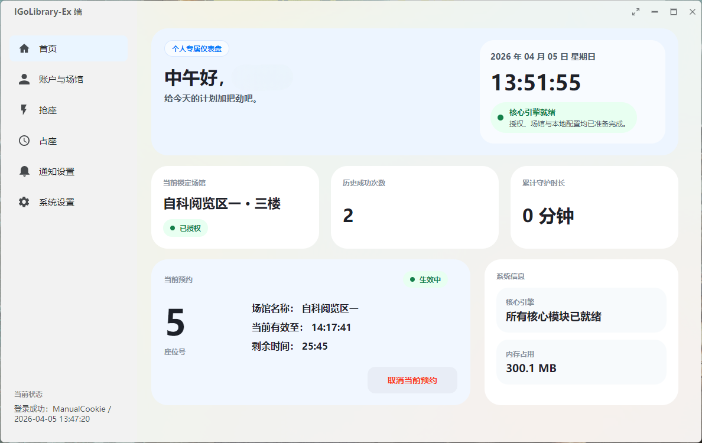

# IGoLibrary

IGoLibrary 是一个围绕“我去图书馆”预约流程重建的桌面客户端。当前仓库主线是 `IGoLibrary-Ex`，使用 Avalonia 重构桌面界面，并加入本地数据持久化、凭据存储、程序内更新检查和 Windows 安装包发布流程。

本项目仅用于学习、研究和个人自动化实验，不隶属于“我去图书馆”平台、学校或图书馆运营方。请在遵守所在学校、场馆和平台规则的前提下了解与使用。



## 主要功能

- 账户授权：支持通过微信登录回调链接获取会话 Cookie，并恢复本地保存的授权状态。
- 场馆管理：自动加载账号可用场馆，支持预览、刷新和锁定当前作业场馆。
- 座位浏览：展示场馆座位布局，支持搜索座位、隐藏已占座位和收藏常用座位。
- 多目标抢座：可以选择多个目标座位并持续监控空闲状态，发现可预约时自动尝试提交。
- 抢座策略：支持直接预约、先查空座再预约、随机空座预约等执行策略。
- 定时任务：支持设定启动时间，让监控任务在指定时间后自动开始。
- 预约管理：可刷新当前预约记录，取消已有预约，并辅助处理到期前重约流程。
- 明日预约：包含明日预约相关的排队、座位选择和提交逻辑。
- 本地提醒：Cookie 失效、抢座成功、任务失败等事件可通过 Toast 弹窗和提示音提醒。
- 邮件提醒：支持配置 SMTP 邮件提醒，用于离开电脑时接收关键任务结果。
- 本地数据：设置、收藏座位、自定义接口模板等数据保存在本机 SQLite 数据库中。
- 安全存储：会话凭据优先保存到 Windows Credential Manager 或 macOS Keychain。
- 程序更新：可读取 GitHub Release 中的 `latest.json`，发现新版本后下载并校验安装器。

## 下载和安装

请到 Releases 页面下载最新版：

```text
https://github.com/Luofaiz/IGoLibrary/releases/latest
```

Windows 用户推荐下载并运行：

```text
IGoLibrarySetup.exe
```

也可以下载便携压缩包：

```text
IGoLibrary-Windows-x64.zip
```

安装后的主程序名为 `IGoLibrary.exe`。当前公开 Release 主要面向 Windows；仓库内保留了 macOS 打包脚本，但未签名、未公证的 macOS 包首次运行时可能需要手动解除系统隔离。

### Android APK

仓库包含一个 Android 原生客户端，可直接生成本地安装用 APK。当前移动端支持打开微信授权入口、展示微信扫码二维码、从剪贴板自动解析授权链接、验证登录、加载场馆、刷新今日/明日座位、输入目标座位后启动今日抢座和明日预约、一键随机空座持续抢座、停止任务、查询当前预约、取消今日/明日预约，以及基于当前预约启动占座守护。手动 Cookie 仍保留为备用方式，不再作为主登录入口。

APK 生成位置：

```text
IGoLibrary-Ex/artifacts/android/IGoLibrary-Android.apk
```

Android 手机安装时需要开启“允许安装未知来源应用”。当前 APK 用于本地测试和侧载安装，暂未接入应用商店发布和正式签名证书。移动端已复用桌面端的抢座、明日预约和占座协调器，但 Android 系统可能限制长时间后台运行；执行任务时建议保持 App 在前台并避免系统省电策略杀掉进程。

移动端微信登录说明：当前项目没有接入微信开放平台 App SDK，因此不能像官方 App 那样完成原生一键微信回跳登录。APK 会尝试打开微信网页授权入口；如果手机系统或微信限制外部唤起，可在 App 内查看二维码，使用微信扫码或识别二维码获取授权链接。授权后复制包含 `code=` 的链接并回到 App，App 会自动从剪贴板解析并登录。

如果手机已开启 USB 调试并连接到电脑，也可以直接安装：

```powershell
cd .\IGoLibrary-Ex
.\build\install-android.ps1
```

## 程序更新

桌面端默认读取这个更新清单：

```text
https://github.com/Luofaiz/IGoLibrary/releases/latest/download/latest.json
```

`latest.json` 会声明最新版本号、安装器下载地址和 SHA256。程序检测到新版本后，会下载 `IGoLibrarySetup.exe`，校验 SHA256，通过后再启动安装器。

每次正式发布建议包含这些 Release 资产：

- `IGoLibrarySetup.exe`
- `latest.json`
- `IGoLibrary-Windows-x64.zip`

## 数据位置

用户数据保存在本机，不会包含在安装包或 GitHub Release 中。

Windows 默认目录：

```text
%LOCALAPPDATA%\IGoLibrary-Ex
```

macOS 默认目录：

```text
~/Library/Application Support/IGoLibrary-Ex
```

主要数据库文件是 `igolibrary-ex.db`，日志位于数据目录下的 `logs` 文件夹。可以通过环境变量 `IGOLIBRARY_EX_DATA_DIR` 覆盖默认数据目录。卸载或安装新版本不会主动删除这些本地数据。

## 开发和构建

主要项目位于 `IGoLibrary-Ex`：

```text
IGoLibrary-Ex/
  src/
    IGoLibrary.Ex.Domain/
    IGoLibrary.Ex.Application/
    IGoLibrary.Ex.Infrastructure/
    IGoLibrary.Ex.Desktop/
    IGoLibrary.Ex.Android/
  tests/
    IGoLibrary.Ex.Tests/
  build/
```

开发环境：

- .NET SDK `10.0.201` 或兼容的 roll-forward 版本
- Windows 安装器构建需要 Inno Setup 6
- Windows 开发可使用 Visual Studio 2022 或 `dotnet` CLI

本地运行：

```powershell
cd .\IGoLibrary-Ex
dotnet restore
dotnet run --project .\src\IGoLibrary.Ex.Desktop\IGoLibrary.Ex.Desktop.csproj
```

运行测试：

```powershell
cd .\IGoLibrary-Ex
dotnet test .\IGoLibrary-Ex.sln -c Release -p:UsedAvaloniaProducts=
```

构建 Windows 安装包和更新清单：

```powershell
cd .\IGoLibrary-Ex
.\build\publish-installer.ps1 -Version "1.0.0" -Notes "Initial release."
```

构建 Android APK：

```powershell
cd .\IGoLibrary-Ex
.\build\publish-android.ps1
```

上传或覆盖 GitHub Release 资产：

```powershell
cd .\IGoLibrary-Ex
.\build\publish-github-release.ps1 -Version "1.0.0" -Repo "Luofaiz/IGoLibrary" -Notes "Initial release."
```

生成产物会写入 `IGoLibrary-Ex/artifacts/`，该目录已被 Git 忽略。

## 历史版本

仓库中保留了旧 WinForms 版本源码和文档，主要用于历史参考：

- `IGoLibrary-Winform/`
- [README_Winform.md](README_Winform.md)

当前 README 只描述 `IGoLibrary-Ex` 主线，不再沿用旧 WinForms 版本的操作说明。

## 安全注意

- 不要提交 `.env`、安装包、数据库、日志、Cookie、Authorization 或个人配置。
- Cookie 和 Authorization 值应视作密码处理。
- 如果接口、GraphQL 模板或平台规则发生变化，请优先停止自动化任务并检查配置。
- 本项目不保证适用于所有学校或所有场馆，也不承诺任何预约结果。

## 致谢

感谢原项目 [EJianZQ/IGoLibrary](https://github.com/EJianZQ/IGoLibrary) 提供的项目基础。

## 许可证

本项目基于 [MIT License](LICENSE.txt) 开源。
